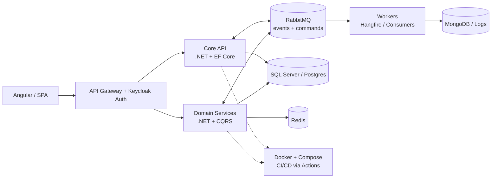

<div align="center">

[](https://github.com/devsharif)

**Full-Stack .NET Engineer · Clean Architecture · Event-Driven Microservices**

[](https://linkedin.com/in/sharifullah)
[](https://www.nuget.org/profiles/devsharif)
[](https://www.hackerrank.com/sharifullah)
[](mailto:dev.sharifullah@gmail.com)
[](https://github.com/devsharif)


</div>

---

## Engineering Profile

<table>
<tr>
<td width="62%" valign="top">

**Sharif Ullah** — Full-Stack Software Engineer from Dhaka, Bangladesh, building production .NET systems since **2020**.

Specialized in **ASP.NET Core + Clean Architecture**: modular monoliths that evolve cleanly into **event-driven microservices** — hardened with Docker, RabbitMQ, Redis, and Keycloak SSO.

**Production track record:** ERP platforms · Diagnostic / hospital management · Payment-gateway integrations · Full-featured boilerplates · Extensions & tooling · Published NuGet packages.

- ◆ Architecture-first: SOLID, DDD, CQRS + MediatR, versioned REST APIs
- ◆ Data: SQL Server, PostgreSQL, MySQL, MongoDB, Redis — EF Core + Dapper
- ◆ Frontend: Angular, TypeScript, admin / ERP / reporting UIs
- ◆ Delivery: Docker Compose one-command stacks, GitHub Actions CI/CD, Serilog observability

</td>
<td width="38%" align="center" valign="middle">

<br/><sub>Music · Cycling · Gaming · Travelling</sub>
</td>
</tr>
</table>

---

## Core Stack

<div align="center">

[](https://github.com/devsharif)
<br/>
[](https://github.com/devsharif)


</div>

<table>
<tr>
<td width="50%" valign="top">

**Backend**
- ASP.NET Core Web API / MVC / Minimal APIs
- Clean Architecture, DDD, CQRS + MediatR
- EF Core, Dapper, FluentValidation
- Keycloak / Identity / JWT / OAuth2 / OIDC
- Hangfire, Quartz, HostedServices

</td>
<td width="50%" valign="top">

**Distributed Systems & DevOps**
- RabbitMQ (exchanges, DLQ, retries, outbox)
- Redis cache, SignalR real-time
- Docker multi-stage + Compose stacks
- Nginx, GitHub Actions, Seq / Serilog
- Health checks, global error handling

</td>
</tr>
<tr>
<td width="50%" valign="top">

**Frontend**
- Angular 2x+, TypeScript, RxJS
- AngularJS legacy migration
- ERP / dashboard / reporting UIs
- HTML / CSS / Bootstrap, Chart.js

</td>
<td width="50%" valign="top">

**Data**
- SQL Server, PostgreSQL, MySQL
- MongoDB, Redis
- Migrations, seeding, auditing
- Reconciliation-safe payment flows

</td>
</tr>
</table>

---

## Architecture Blueprint

Standard layout for every serious backend:

```
src/
├── Domain/            # entities, value objects, domain events, interfaces
├── Application/       # CQRS handlers, DTOs, validators, pipelines, specs
├── Infrastructure/    # EF Core, RabbitMQ, Redis, Keycloak, email/SMS, jobs
└── WebApi/            # controllers / minimal APIs, middleware, versioning
```



**Engineering defaults:** SOLID · idempotent consumers · versioned REST · EF migrations · Serilog + Seq · audit trails · `api + db + rabbitmq + keycloak + redis` up in one command.

---

## Selected Work

| Domain | Highlights |
|---|---|
| **ERP System** | Inventory, sales / purchase, HR & payroll, accounts · role-based access · reporting + audit trails |
| **Diagnostic Management** | Patient registration, test booking, lab workflow, report delivery, billing |
| **Payment Gateways** | Checkout, callbacks / webhooks, reconciliation, failure retries |
| **SU Boilerplate** | Full-featured .NET starter — Clean Architecture, auth / roles, CRUD scaffolding, notifications |
| **Extensions & Tooling** | `AngularProjectGenerator` one-click scaffold · `js-media-selector` · WinForms utilities |
| **NuGet Packages** | `SUAspNetCore.Notifier` — server-side toasts for ASP.NET Core · [nuget.org/profiles/devsharif](https://www.nuget.org/profiles/devsharif) |

→ Full index: [github.com/devsharif?tab=repositories](https://github.com/devsharif?tab=repositories)

<details>
<summary><b>SU Boilerplate — visual preview (10 screens)</b></summary>
<br/>
<p align="center">
  </img> </img> </img> </img> </img> </img> </img> </img> </img> </img>
</p>
</details>

---

## Analytics

<div align="center">


<br/>


<sub>Contribution graph + streak are live. Detailed language mix is covered in <b>Core Stack</b> above.</sub>

</div>

---

<div align="center">

**Let's build systems that scale.**

📧 **dev.sharifullah@gmail.com** · 💼 [linkedin.com/in/sharifullah](https://linkedin.com/in/sharifullah) · 📦 [nuget.org/profiles/devsharif](https://www.nuget.org/profiles/devsharif)

<sub>Clean input → solid architecture → shippable output.</sub>

</div>
